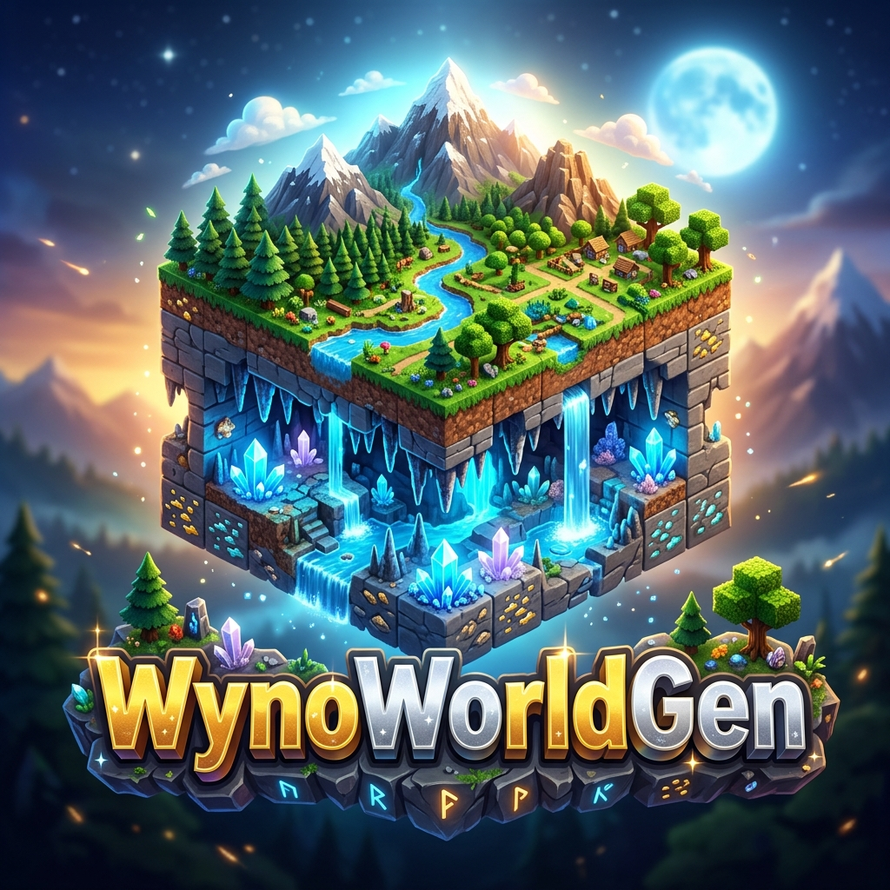

# WYNO GEN 🌍

<p align="center">
  
</p>

<p align="center">
  
  
  
  
  <a href="https://discord.gg/9WJSP4Kqg4">
    
  </a>
</p>

<p align="center">
  <strong>Expertly Managed Difficulty-Based Survival Worlds with Seamless Persistence.</strong><br>
  Enterprise-grade data isolation. Async database pipeline. Zero TPS impact.
</p>

---

## ✨ Overview

**WynoWorldGen** is a professional-grade world management solution for Minecraft servers. It allows you to create multiple, difficulty-specific survival environments (`EASY`, `MEDIUM`, `HARD`) that are completely isolated from one another. Each environment includes its own private Overworld, Nether, and End dimensions.

---

## 🚀 Pro Features

### 🌍 Companion World System (The Multiverse)
Every world created is a "Mode" containing three dimensions that share a single data profile:

| Mode | Overworld | Nether | End |
|:---|:---|:---|:---|
| **Easy** | `EasyWorld` | `EasyWorld-nether` | `EasyWorld-end` |
| **Medium** | `MediumWorld` | `MediumWorld-nether` | `MediumWorld-end` |
| **Hard** | `HardWorld` | `HardWorld-nether` | `HardWorld-end` |

*   **Native Persistence**: Your inventory, health, and location are saved exactly where you leave them. Join back and you're right where you left off.
*   **Dimensional Unity**: Moving between Overworld, Nether, and End is seamless. Your items and health carry over instantly as they do in vanilla.
*   **Smart Respawn**: Dying in the Nether or End sends you back to your Bed Spawn in the parent Overworld.
*   **Automated Lifecycle**: Companion worlds are created, loaded, and deleted automatically with the parent world.

### 🔒 Data Isolation 2.0
Each Mode (`Easy`, `Medium`, `Hard`) is a distinct data silo. A player's progress in one does not affect the other. Isolated data includes:
*   Inventory, Armor, and Ender Chest.
*   Health, Food, Saturation, and XP levels.
*   Active Potion Effects and GameMode.
*   Detailed Advancement Criteria.

### ⚡ Technical Excellence
*   **Async Core**: All database I/O is offloaded to background threads. Your main thread remains at 20 TPS.
*   **HikariCP Connection Pool**: High-performance MySQL/MariaDB management.
*   **Safe-Teleport**: Built-in damage invulnerability buffer during world transitions.

---

## 📥 Installation Guide

Follow these steps for a perfect deployment:

1.  **Download**: Get the latest `WynoWorldGen-6.2.1.jar` from the **[Releases](https://github.com/wynoislive/WynoWorldGen/releases)** page.
2.  **Upload**: Place the file into your server's `/plugins` directory.
3.  **Start**: Restart your server to generate the default configuration files.
4.  **Configure**: Open `plugins/WynoWorldGen/config.yml` to set your database preferences (SQLite is used by default).
5.  **Ready**: Use `/fw create <name> <difficulty>` to build your first survival mode.

---

## 🛠 Commands & Usage

| Command | Usage Example | Permission |
|:---|:---|:---|
| `/fw join <name>` | `/fw join Survival_1` | `wynogen.use` |
| `/fw exit` | Returns you to the main spawn. | `wynogen.use` |
| `/fw list` | View all active modes and dimension status. | `wynogen.use` |
| `/fw create <n> <d> [t]` | `/fw create HardSMP HARD tight` | `wynogen.admin` |
| `/fw delete <name>` | Permanently unloads and deletes data. | `wynogen.admin` |
| `/fw reload` | Reload configurations and messages. | `wynogen.admin` |
| `/fw update` | Downloads the latest version automatically. | `wynogen.admin` |
| `/fw rollback` | Reverts to the previous backup JAR. | `wynogen.admin` |

---

## ⚙️ Detailed Configuration (`config.yml`)

```yaml
options:
  save_interval_ticks: 6000     # How often data auto-saves (300 seconds)
  safety_buffer_ticks: 60       # Ticks of invulnerability after world change
  
  # Dimension Management
  generate_nether: true          # Auto-create Nether for new worlds
  generate_end: true             # Auto-create End for new worlds
  
  # Portal Controls
  disable_nether_portals: false  # Block Nether portal travel
  disable_end_portals: false     # Block End portal travel
  disable_portals: false         # Legacy blanket block
  
  respawn_in_same_world: true    # Keep player in the Mode world on death
  metrics: true                  # Support development with bStats
  
  updater:
    auto_check: true             # Notify admins of new releases
    notify_admins: true
```

---

## 🗄️ Database Setup

### Option A: SQLite (Small Servers)
Simply leave the `database.type` as `SQLITE`. The plugin will create a local `data.db` file automatically.

### Option B: MySQL (High Performance)
1.  Change `database.type` to `MYSQL`.
2.  Fill in your `DB_HOST`, `DB_PORT`, `DB_NAME`, `DB_USER`, and `DB_PASSWORD`.
3.  Run `/fw reload`. The plugin will migrate your connection instantly.

---

## 📚 Support & Wiki

For advanced setup, developer API, and detailed localization guides:
👉 **[WynoWorldGen Official Wiki](https://github.com/wynoislive/WynoWorldGen/wiki)**

Join our developer community for real-time support:
👉 **[Discord Support Server](https://discord.gg/9WJSP4Kqg4)**

---

<p align="center">© 2026 <strong>WYNO</strong> — Professional World Generation Architecture.</p>
